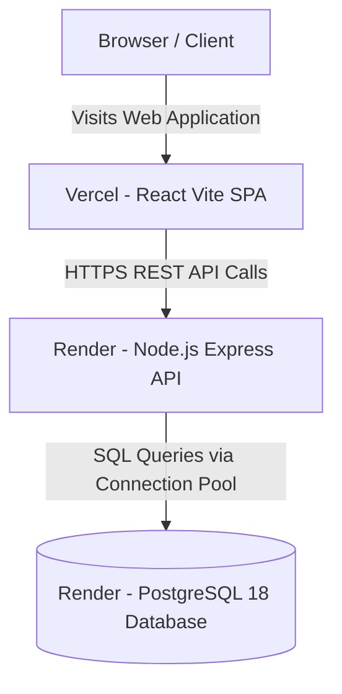

# LocalCommerce

LocalCommerce is a multi-tenant local commerce platform with a marketplace-style discovery layer. It bridges the gap between independent neighborhood merchants and modern on-demand retail by allowing store owners to digitize their inventory, operations, and fulfillment within a shared local marketplace.

The platform provides dedicated, role-scoped workflows for all commerce participants:
- **Businesses** manage their own stores, products, inventory, orders, fulfillment, staff, customers, discounts, analytics, notifications, and operational settings.
- **Customers** discover nearby stores, browse products, maintain a persistent cart, place orders, track delivery milestones, manage addresses, and leave reviews on completed orders.
- **Delivery Staff** manage assigned delivery dispatches through a specialized execution dashboard.
- **Platform Admins** oversee platform-level operations, global product cataloging, store moderation, user access, and system settings.
- **Unified Identity:** A single customer account works seamlessly across all stores on the marketplace.
- **Strict Store Scoping:** Each order belongs exclusively to a single store.
- **Flexible Fulfillment:** Both local delivery and in-store pickup are natively supported.
- **Catalog Separation:** Canonical global product identities are cleanly separated from store-specific listings, pricing, and inventory.

---

## Features

### Customer
- **Store Discovery:** Browse and discover active neighborhood stores with location, category, and status indicators.
- **Catalog Browsing & Search:** Search products and categories across available local merchants.
- **Storefront Pages:** View store-specific profiles, operating hours, delivery fees, and minimum order requirements.
- **Product Details:** Inspect product descriptions, units, MRP, store pricing, and real-time stock availability.
- **Cart Management:** Maintain persistent cart items with client-side and server-side store validation.
- **Checkout & Address Management:** Save multiple delivery addresses with default selection and place delivery or pickup orders.
- **Order Tracking:** Track real-time order progression from placement to final fulfillment.
- **Payment Flow:** Support for Cash on Delivery (COD) and simulated UPI payment methods with transactional state updates.
- **Reviews & Ratings:** Submit ratings and comments on completed orders and products.

### Business
- **Store Onboarding:** Register new merchant accounts and complete step-by-step store profile onboarding.
- **Multi-Store Management:** Support for merchants operating multiple stores with an authenticated store switcher.
- **Product & Category Management:** Create and organize store categories, or map listings to canonical catalog products.
- **Inventory Control:** Manage store SKUs, unit pricing, cost prices, stock quantities, and low-stock alert thresholds.
- **Order Management:** View, filter, and transition incoming store orders through operational fulfillment states.
- **Fulfillment Dispatch:** Choose between in-store pickup completion or assigning orders to dedicated delivery staff.
- **Staff Management:** Create and manage store staff and delivery personnel accounts scoped to the store.
- **Discounts & Promotions:** Configure percentage-based or flat-rate coupon codes with minimum spends and usage limits.
- **Store Analytics:** Review revenue KPIs, order volume metrics, low-stock warnings, and recent customer activity.
- **Notifications & Settings:** Manage operational parameters, delivery radiuses, base delivery fees, tax settings, and business hours.
- **Online/Offline Status:** Instantly toggle whether a store is online and actively accepting customer orders.

### Delivery Staff
- **Delivery Dashboard:** Role-restricted interface displaying active, pending, and completed delivery dispatches.
- **Assigned Orders:** View detailed recipient addresses, contact details, order totals, and payment collection statuses.
- **Milestone Progression:** Structured delivery workflow: `READY` → `OUT_FOR_DELIVERY` → `DELIVERED`.

### Admin
- **Platform Dashboard:** Platform-wide metrics, active store counts, registered users, and total order volume.
- **Store Management:** Directory of all merchant stores with activation, moderation, and detailed profile inspection.
- **User Management:** Platform-wide directory of customer, merchant, staff, and admin accounts.
- **Global Product Catalog:** Curate standardized brand products (barcodes, units, standard images, and MRPs).
- **Store Listings & Moderation:** Audit store-level product listings and pricing across the ecosystem.
- **Review Moderation:** Inspect and moderate published customer reviews.
- **Subscription Management:** Configure merchant subscription tiers (Free, Starter, Business, Pro) with product and staff limits.
- **Platform Configuration:** Manage platform-wide operational toggles, maintenance mode, and support metadata.

---

## Architecture

LocalCommerce is designed as a decoupled client-server web application backed by a relational database:

- **Frontend:** React Single Page Application (SPA) powered by Vite, utilizing React Router for role-based route management, React Context for state synchronization, and Vanilla CSS / CSS Modules for custom styling.
- **Backend:** Node.js service built with Express.js, providing RESTful JSON APIs, JWT authentication, and connection pooling via `pg`.
- **Database:** PostgreSQL relational database enforcing relational integrity, foreign keys, constraints, and indexed queries.
- **Deployment:**
  - **Frontend:** Vercel (Vite React SPA with client-side routing rewrites).
  - **Backend:** Render Web Service (Node.js/Express HTTP server).
  - **Database:** Render PostgreSQL managed database.



---

## Multi-Tenant Architecture

LocalCommerce uses a shared-database, shared-schema multi-tenant design where tenant boundaries are strictly enforced at the application and database relationship layers:

- **Store-Scoped Isolation:** Store-specific records (`categories`, `store_products`, `orders`, `store_settings`, `discounts`) are explicitly keyed by `store_id`.
- **Role-Based Membership (`store_users`):** Business owners, managers, staff, and delivery staff are associated with specific stores through the `store_users` junction table. Backend middleware verifies that authenticated users can only access or mutate stores they belong to.
- **Canonical vs. Local Catalog Separation:**
  - **`global_products`:** Represents canonical brand reference data (e.g., standard title, brand, barcode, MRP, reference image). It holds zero store-specific pricing or stock.
  - **`store_products`:** Represents a specific merchant's listing with independent price, cost price, inventory, low-stock threshold, SKU, and local image.
  - **Custom Listings:** Stores can create custom local products with or without linking to a `global_product_id`.

### Pricing & Listing Example

**Canonical Product:** `Amul Taaza Milk 1L` (MRP ₹72)
- **Sharma Supermarket:** Listed at **₹68** (Stock: 50, SKU: `SH-MILK-001`)
- **Shree Kirana:** Listed at **₹70** (Stock: 35, SKU: `SK-MILK-001`)
- **Raj Store:** Listed at **₹67** (Stock: 20, SKU: `RAJ-MILK-001`)

The global catalog establishes identity, while merchants retain full autonomous control over their stock and retail pricing.

---

## Order & Fulfillment Flow

All order pricing, inventory validations, and transitions are authoritatively managed on the backend:

### Delivery Workflow
```text
PLACED → CONFIRMED → PREPARING → READY → OUT_FOR_DELIVERY → DELIVERED
```
1. **Placement:** Customer places order; server recalculates subtotal, discounts, tax, and delivery fee, validating and decrementing stock transactionally.
2. **Confirmation & Preparation:** Merchant confirms and prepares order items.
3. **Dispatch Assignment:** Merchant assigns order to available store delivery staff (`delivery_assignments` record created).
4. **Transit & Delivery:** Delivery staff marks order `OUT_FOR_DELIVERY` upon departure and `DELIVERED` upon handover.

### Pickup Workflow
```text
PLACED → CONFIRMED → PREPARING → READY_FOR_PICKUP → DELIVERED
```
1. In-store pickup orders bypass delivery staff assignment.
2. Merchant prepares order and marks it `READY_FOR_PICKUP`.
3. Handover is completed directly by store staff.

### Cancellation
- Customers may cancel orders while in the `PLACED` state.
- Store managers can cancel unfulfilled orders, triggering inventory restock.

---

## Authentication & Authorization

- **JWT Authentication:** Stateless JSON Web Tokens issued upon login and validated via the HTTP `Authorization: Bearer <token>` header.
- **Registration:** Dedicated public customer signup and merchant store onboarding endpoints.
- **Unified Login:** Shared login endpoint authenticating all system roles.
- **Route Protection:** Frontend routes wrapped in `ProtectedRoute` components enforcing authenticated state and role allowances.
- **Backend Middleware:**
  - `authMiddleware.js`: Verifies JWT signature and extracts user context.
  - `roleMiddleware.js`: Restricts operations to specified roles.
  - `storeAuthMiddleware.js`: Enforces store-level multi-tenant membership checks.
- **Data Ownership Protection:** Customer address, order history, and payment details are strictly restricted to the owning account.
- **Supported System Roles:**
  - `customer`
  - `business_owner`
  - `staff`
  - `delivery_staff`
  - `admin`
- **Password Security:** Password hashing powered by `bcryptjs` with salt rounds.

---

## Database

The PostgreSQL relational database is structured into 19 tables enforcing relational integrity:

1. **`users`:** Platform user accounts, role definitions, and hashed credentials.
2. **`stores`:** Merchant store entities, operational profiles, and contact details.
3. **`store_users`:** Tenant junction linking users to stores with store-level roles.
4. **`customers`:** Customer identity profiles linked 1:1 with user records.
5. **`customer_addresses`:** Saved delivery addresses per customer account.
6. **`categories`:** Store-specific taxonomy organizing product listings.
7. **`global_products`:** Shared master catalog of branded products.
8. **`store_products`:** Store inventory listings, retail pricing, and stock levels.
9. **`store_settings`:** Operating hours, delivery radiuses, base delivery fees, and toggles.
10. **`discounts`:** Store-managed promotional vouchers and discount rules.
11. **`orders`:** Core transactional order records with calculated financials and delivery metadata.
12. **`order_items`:** Line items belonging to specific orders.
13. **`payments`:** Payment records linked 1:1 with orders.
14. **`delivery_assignments`:** Delivery dispatches linked to orders, stores, and delivery personnel.
15. **`reviews`:** Customer ratings and comments on products and stores.
16. **`notifications`:** In-app operational alerts for merchants and customers.
17. **`subscription_plans`:** Master definitions of platform merchant subscription tiers.
18. **`store_subscriptions`:** Active subscription tier mappings per store.
19. **`platform_settings`:** Platform-wide operational configuration key-values.

---

## API

### Health
- `GET /api/health` — Verifies Express API and PostgreSQL connectivity.

### Authentication
- `POST /api/auth/register/customer` — Register a new customer account.
- `POST /api/auth/register/business` — Register a merchant owner and initialize store profile.
- `POST /api/auth/login` — Authenticate and receive a JWT token.

### Stores
- `GET /api/stores` — List active stores on the marketplace.
- `POST /api/stores` — Create a new merchant store.
- `GET /api/stores/:id` — Retrieve public store profile details.
- `PATCH /api/stores/:id` — Update store details (store owner only).
- `GET /api/stores/:storeId/settings` — Retrieve operational settings.
- `PATCH /api/stores/:storeId/settings` — Update store operational settings.
- `GET /api/stores/:storeId/analytics` — Retrieve store revenue and order metrics.
- `GET /api/stores/:storeId/notifications` — Retrieve store notifications.

### Categories
- `GET /api/categories` — List store categories (public / store-scoped).
- `POST /api/categories` — Create a new store category.
- `GET /api/categories/:id` — Get single category details.
- `PATCH /api/categories/:id` — Update category details.

### Global Products
- `GET /api/global-products` — Browse canonical master catalog.
- `POST /api/global-products` — Add canonical product (admin only).
- `GET /api/global-products/:id` — Get canonical product details.
- `PATCH /api/global-products/:id` — Update canonical product (admin only).

### Store Products
- `GET /api/stores/:storeId/products` — Retrieve listings for a specific store.
- `POST /api/stores/:storeId/products` — Create a store product listing.
- `GET /api/stores/:storeId/products/:id` — Get single product details.
- `PATCH /api/stores/:storeId/products/:id` — Update listing, price, or inventory.
- `DELETE /api/stores/:storeId/products/:id` — Archive or remove product listing.

### Customers & Addresses
- `GET /api/customers/me` — Get current customer profile.
- `PATCH /api/customers/me` — Update customer profile information.
- `GET /api/customers/me/addresses` — List saved delivery addresses.
- `POST /api/customers/me/addresses` — Add a new delivery address.
- `GET /api/customers/me/addresses/:id` — Get address by ID.
- `PATCH /api/customers/me/addresses/:id` — Update address details.
- `DELETE /api/customers/me/addresses/:id` — Delete address.

### Orders
- `POST /api/orders` — Create and place a new order.
- `GET /api/orders` — List user's orders (customer) or store orders (merchant).
- `GET /api/orders/:id` — Get detailed order summary and line items.
- `PATCH /api/orders/:id/status` — Transition order operational status.
- `POST /api/orders/:orderId/delivery-assignment` — Assign order to delivery staff.

### Payments
- `GET /api/payments/:orderId` — Get payment record for an order.
- `POST /api/payments/:orderId/process` — Process or record order payment.

### Delivery
- `GET /api/delivery/assignments` — List assigned deliveries for delivery staff.
- `PATCH /api/delivery/assignments/:assignmentId/status` — Update delivery status.

### Reviews
- `POST /api/reviews` — Submit a review for a completed order.
- `GET /api/reviews` — List reviews for a product or store.

### Staff & Customers (Business)
- `GET /api/stores/:storeId/staff` — List store staff and delivery members.
- `POST /api/stores/:storeId/staff` — Add a staff or delivery staff account.
- `DELETE /api/stores/:storeId/staff/:userId` — Remove staff member.
- `GET /api/stores/:storeId/customers` — List store customer directory.
- `GET /api/stores/:storeId/customers/:customerId` — View customer profile and order history.
- `GET /api/stores/:storeId/discounts` — List store discount coupons.
- `POST /api/stores/:storeId/discounts` — Create a new discount coupon.

### Admin
- `GET /api/admin/overview` — Platform KPI overview.
- `GET /api/admin/stores` — Platform store directory.
- `GET /api/admin/users` — Platform user directory.
- `GET /api/admin/orders` — Platform-wide orders list.
- `GET /api/admin/reviews` — Moderate customer reviews.
- `PATCH /api/admin/reviews/:id/status` — Update review status.
- `GET /api/admin/subscriptions` — View merchant subscription plans.
- `GET /api/admin/settings` — View platform configuration.
- `PATCH /api/admin/settings` — Update platform configuration.

---

## Project Structure

```text
LocalCommerce/
├── frontend/
│   ├── src/
│   │   ├── components/      # UI components (customer, business, admin, shared)
│   │   ├── context/         # React Context state management
│   │   ├── hooks/           # Custom React hooks
│   │   ├── layouts/         # Layout wrappers per role
│   │   ├── pages/           # Application views and routes
│   │   ├── services/        # API service clients
│   │   ├── App.jsx          # Route configuration
│   │   ├── main.jsx         # Application root mount
│   │   └── index.css        # Core design tokens and global styles
│   ├── public/              # Static assets and icons
│   ├── vercel.json          # Vercel SPA routing configuration
│   ├── package.json         # Frontend dependencies and scripts
│   └── vite.config.js       # Vite build configuration
├── backend/
│   ├── src/
│   │   ├── config/
│   │   │   └── db.js        # PostgreSQL pool configuration
│   │   ├── controllers/     # API route handlers
│   │   ├── middleware/      # Auth, role, and store tenancy middleware
│   │   ├── routes/          # Express route definitions
│   │   ├── scripts/         # Verification and seed scripts
│   │   └── server.js        # Express app initialization and lifecycle
│   ├── database/
│   │   ├── schema.sql           # Idempotent 19-table DDL schema
│   │   ├── seed_production.sql  # Baseline catalog seed data
│   │   └── initRenderDb.js      # Production database initialization script
│   ├── package.json         # Backend dependencies and start scripts
│   └── .env.example         # Template for environment variables
└── README.md
```

---

## Local Development

### Prerequisites
- Node.js (v18+)
- PostgreSQL (v18+)

### 1. Backend Setup
```bash
cd backend
npm install
```
Copy `.env.example` to `.env` and configure your local PostgreSQL database credentials:
```bash
copy .env.example .env
```
Start the backend server:
```bash
npm start
```
The server will start on port `5000` (or `process.env.PORT`). Verify connectivity by visiting:
```text
http://localhost:5000/api/health
```

### 2. Frontend Setup
```bash
cd frontend
npm install
```
Copy `.env.example` to `.env` if custom API host mapping is required (defaults to `http://localhost:5000`):
```bash
copy .env.example .env
```
Start the development server:
```bash
npm run dev
```
Open `http://localhost:5173` in your browser.

---

## Production Deployment

### Deployment Topology
- **Frontend:** Deployed to **Vercel** as a Vite React SPA using [vercel.json](file:///d:/LocalCommerce/frontend/vercel.json) for client-side routing rewrites.
- **Backend:** Deployed to **Render** as a Node.js Web Service running `npm start`.
- **Database:** Managed **PostgreSQL 18** instance hosted on Render.

### Production Initialization
The production database on Render is initialized using the standalone migration and seeding script:
```bash
node backend/database/initRenderDb.js "<RENDER_EXTERNAL_DATABASE_URL>"
```
- Applies [backend/database/schema.sql](file:///d:/LocalCommerce/backend/database/schema.sql) to establish all 19 tables, indexes, and constraints.
- Applies [backend/database/seed_production.sql](file:///d:/LocalCommerce/backend/database/seed_production.sql) to populate baseline catalog taxonomies, standard products, baseline stores, settings, and subscription tiers.
- Does not seed mock orders, test customers, payments, or dispatches.

---

## Environment Variables

Configuration is managed via environment variables. Real credentials must never be committed to Git.

### Frontend (`frontend/.env`)
```env
VITE_API_URL=http://localhost:5000
```
*(In production, set `VITE_API_URL` to your Render backend domain, e.g. `https://localcommerce-backend.onrender.com`)*

### Backend (`backend/.env`)
```env
PORT=5000
DB_HOST=localhost
DB_PORT=5432
DB_NAME=localcommerce
DB_USER=postgres
DB_PASSWORD=your_postgres_password
JWT_SECRET=your_jwt_secret_key_here
JWT_EXPIRES_IN=1d
DEV_SEED_PASSWORD=your_dev_seed_password
```
*(In production on Render, `DATABASE_URL` is automatically supplied by the managed PostgreSQL service with SSL enabled).*

---

## Testing & Validation

The codebase includes automated test scripts and verification routines:
- **Linting & Code Quality:** ESLint validation across frontend components (`npm run lint`).
- **Production Build:** Vite production bundle compilation (`npm run build`).
- **Health Check:** Live API and PostgreSQL ping via `/api/health`.
- **Authentication & Authorization:** Role-based access control and JWT validation suites.
- **Multi-Tenant Isolation:** Store boundaries and cross-store data leak prevention tests.
- **Customer Data Ownership:** Scoped customer address, order history, and payment isolation audits.
- **Order & Payment Lifecycle:** Full end-to-end testing of order placement, inventory deduction, and status updates.
- **Fulfillment Workflows:** End-to-end verification of both delivery staff dispatch and in-store pickup cycles.
- **Database Verification:** Validation of schema creation and production catalog seeding.

---

## Security

- **Stateless Tokens:** JWT-based session handling with standard expiration.
- **Credential Protection:** Passwords securely hashed with `bcryptjs`.
- **Role Enforcement:** Strict authorization checks on all operational endpoints.
- **Tenancy Guards:** Server-side verification ensuring store owners only manage their assigned stores.
- **Customer Privacy:** Endpoints strictly scoped to the authenticated customer ID.
- **Transactional Consistency:** Stock validation and order placement executed transactionally to prevent overselling.
- **Environment Isolation:** Secrets and configuration variables strictly excluded from version control via `.gitignore`.

---

## Current Status

### Status: Deployed MVP
- React frontend configured for Vercel deployment with client-side SPA rewrites.
- Node.js/Express backend configured for Render Web Service deployment with graceful shutdown handlers and dynamic port binding.
- Production PostgreSQL 18 database provisioned and seeded on Render.
- End-to-end commerce cycle (Customer, Business, Delivery, Admin) fully functional.
- Ongoing validation continues for real-data edge cases and production monitoring.

---

## Future Improvements

- Payment gateway integration (Razorpay, Stripe)
- Third-party logistics (3PL) and automated courier dispatch integrations
- Barcode-based inventory scanning and product lookup
- Custom domains and branding for individual merchant stores
- Richer customer review moderation and merchant replies
- Advanced business analytics and reporting dashboards
- Automated SMS and WhatsApp order updates
- AI-assisted cataloging and inventory insights

---

## Author

**Yash Gawad**
